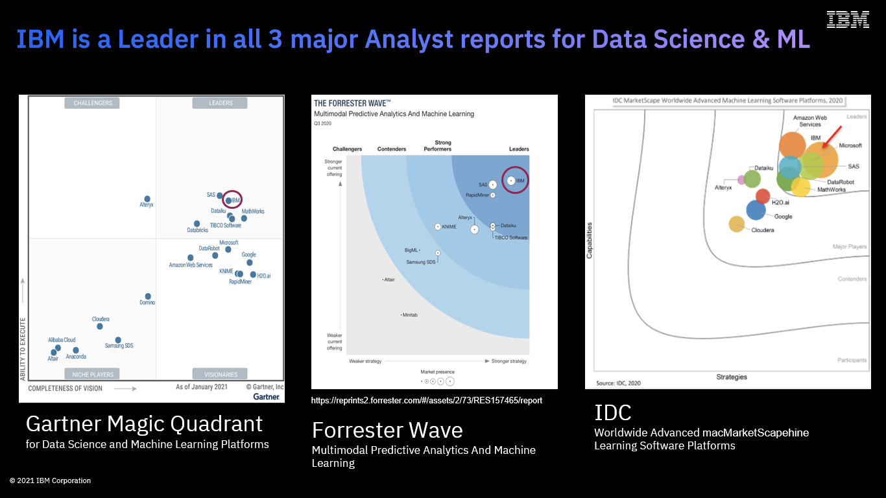
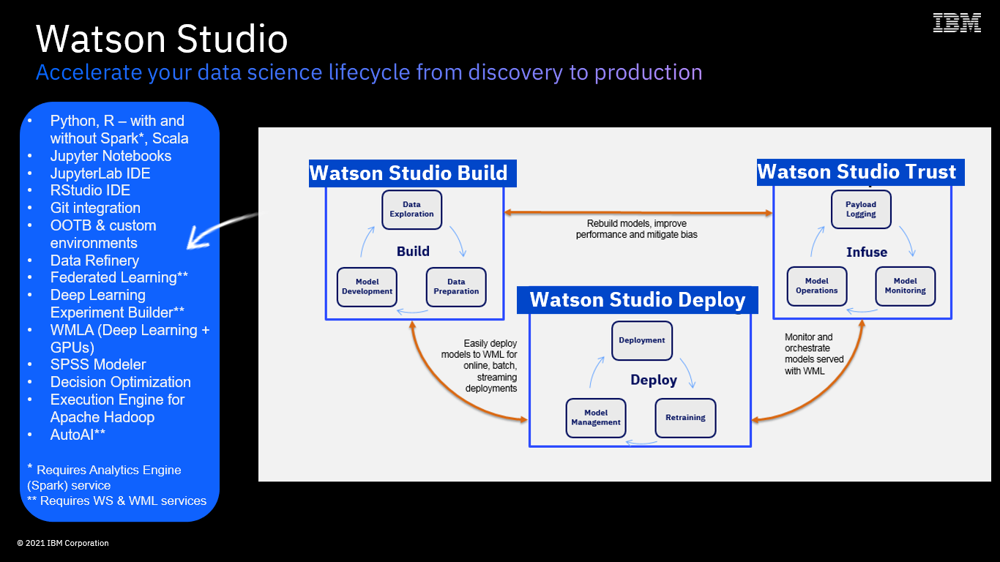

TODO: Short Introduction, Prerequisites etc.

Use-Case

You are a data scientist employed by ABCOnlineRetailXYZ Ltd. The online
retailer has not been doing that great lately and has been losing
customers to competition. While it is clear that its customer churn
rates have been growing, figuring out which customers are more likely to
churn is proving hard.

Your manager came by your desk today, gave you a couple of files
containing some customer-related data and asked you to build a model
helping the business understand which of its customers may churn in the
near future, so that Marketing could proactively target them with
personalized incentives and discount vouchers.

You have a lot of other work to do and are a short on time,and are in
need of inspiration – your Python skills are a bit rusty.  
You are aware that IBM provides market-leading data science tooling and
decide to use IBM’s Watson Studio running on
CPDaaS to build and test your model.

Figure 1:IBM’s market position

IBM’s Cloud Pak for Data provides a range of
capabilities catering for the whole data science life cycle – from data
preparation, to model build, deployment, training and monitoring.

Figure 2: IBM's Data Science Portfolio

The platform’s Data Science and ML component(s)
sit under the Watson Studio branding umbrella. Cloud Pak for Data’s Watson Studio services (Watson Studio / Watson
Studio Build, Watson Machine Learning / Watson Studio Deploy, Watson
Openscale / Watson Studio Trust) enable the Build, Run and Manage
capabilities of the MLOps lifecycle.

Figure 3: Watson Studio's components

In this Lab, you will:

-   [Use AutoAI to automatically build the most optimal customer churn
    prediction model based on your data sets](#bookmark)

-   [And, finally, deploy and test that model with Watson Machine
    Learning (Watson Studio Deploy capabilities).](#bookmark1)

… and, your model will be built (for you!) and deployed in minutes - not
hours or days!
